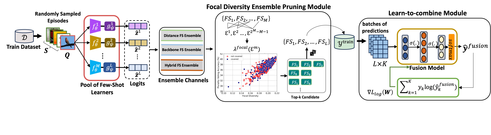

# Robust Few-Shot Ensemble Learning with Focal Diversity-Based Pruning


We present `FusionShot` a focal diversity optimized few-shot ensemble learning framework with three steps.
1) Obtain training and validation predictions for each base Few-shot Learning Model.
2) Select the best ensemble set among the pool of Few-Shot Learners using Genetic Algorithm.
3) Train FusionShot model on top of the base-models using training-val predictions and perform prediction for novel classes.

## Installation
```
$ pip install requirements.txt
```

## Datasets
Download the mini-Imagenet and CUB datasets at the following link and extract them under `base_model_src/filelists/<datasetname>`

- Mini-Imagenet Link: https://www.dropbox.com/scl/fi/1i5zt3m3o1hmu34ywsl9d/miniImagenet.zip?rlkey=hlwhs3p729uyzpn5yd785lb7c&dl=0
- CUB Link: https://www.dropbox.com/scl/fi/j6208ndbc7e7qvzo0qfgh/CUB.zip?rlkey=3lcyfpmx85wa46u5bk814goki&dl=0

Then run the python scripts create_split_jsons.py inside filelists/CUB/ and filelists/miniImagenet/ folders 

## Models
The trained base-models for each dataset can be found at the link on below.

- CUB models Link: https://www.dropbox.com/scl/fi/92ebuenjg4sqfb4z9oedm/CUB_models.zip?rlkey=90fo8gouds3zmsf5xuzmeqhm0&dl=0
- Mini-Imagenet models Link: https://www.dropbox.com/scl/fi/y0ythukn7zmm7fhqmzq6f/miniImagenet_models.zip?rlkey=5rq2sm8xbqj0vakbs96lpxwzr&dl=0

Extract them under `checkpoints/`.


# Running

## Obtaining Predictions from Base Models
To obtain 5way 1shot predictions for miniImagenet
```
$ cd base_model_src/
$ ./inference_miniImagenet_5way_1shot.sh
```

## Pruning the ensemble set
To perform bruteforce to see all the ensemble combinations
```
$ cd ens_pruning_src/
$ ./run_bruteforce.sh
```

To perform Genetic Algorithm to select the best performing combinations
```
$ cd ens_pruning_src/
$ ./run_ga.sh
```


## Training and Running Fusionshot
After you observe the best ensemble set by runing the pruning scripts, you can train your FusionShot model by calling,
```
$ cd fusionshot_src/
$ ./run_train.sh
```


